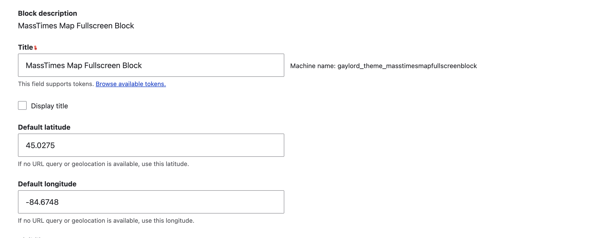
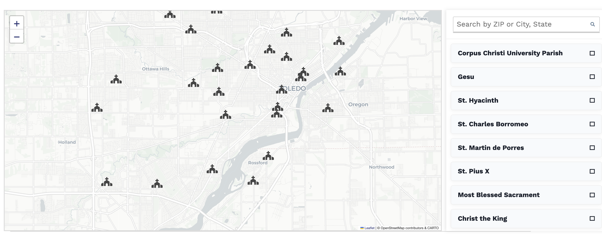

# MassTimes Widget

A custom Drupal module embedding a full-screen interactive map and sidebar list of Catholic parishes, powered by the MassTimes Trust database & API.

## 🚀 Features

- **Auto-detect** your current location via browser geolocation
- **Fallback** to configurable default latitude/longitude if geolocation is unavailable or denied
- **Search** by ZIP code or City, State (US-only autocomplete via Nominatim)
- **Interactive map** (Leaflet) with parish markers & popups
- **Scrollable sidebar** of parish details, synchronized with map clicks
- **Mobile-friendly** responsive layout

## 🔧 Installation

1. Clone or download into `web/modules/custom/masstimes_widget`.
2. Run `drush en masstimes_widget -y` (or enable via the UI).
3. Clear caches: `drush cr`.

No contrib module dependencies are required. Leaflet is loaded from a CDN by the
module's own asset library.

> [!WARNING]
> **Font Awesome is not shipped with this module.** The map markers, search
> form, and parish cards all render Font Awesome icons, so make sure your theme
> or another module already loads Font Awesome site-wide. Without it, those
> icons render as blank boxes.

## ⚙️ Configuration

1. In the Block layout screen, place the **MassTimes Map Fullscreen Block**.
2. Under **Default latitude** and **Default longitude**, enter your preferred fallback coordinates.

   

3. When viewing the page, the map will render full-width with the sidebar alongside:

   

## 🧩 How It Works

The map centre is resolved in a fixed order:

1. `?lat=…&long=…` in the URL, read server-side by the block plugin.
2. Browser geolocation, which reloads the page with those query arguments.
3. The **Default latitude**/**Default longitude** configured on the block, used
   when geolocation is denied or unsupported.

From there:

- **Block plugin** (`MassTimesMapBlock`) calls the MassTimes API
  (`https://apiv4.updateparishdata.org/Churchs/`) for nearby churches, sorts
  them by distance, and builds a GeoJSON feature collection.
- The Twig template (`masstimes-map.html.twig`) renders the map container and sidebar.
- The accompanying JS behavior initializes the Leaflet map, adds parish markers,
  and ties marker clicks to opening the corresponding `
` in the sidebar.
- The module ships with CSS for a full-width layout, responsive sidebar, and
  styled parish cards.

## 🙏 Credits

- **Peter Wagner & the MassTimes Trust** ([masstimes.org](https://masstimes.org/)) for their comprehensive global database of Catholic parishes and worship times.
- **Leaflet** for interactive maps.
- **Nominatim (OpenStreetMap)** for address/ZIP autocomplete.

## 📝 License

Licensed under GPL-2.0-or-later. All church data © Mass Times Trust; used with permission.
